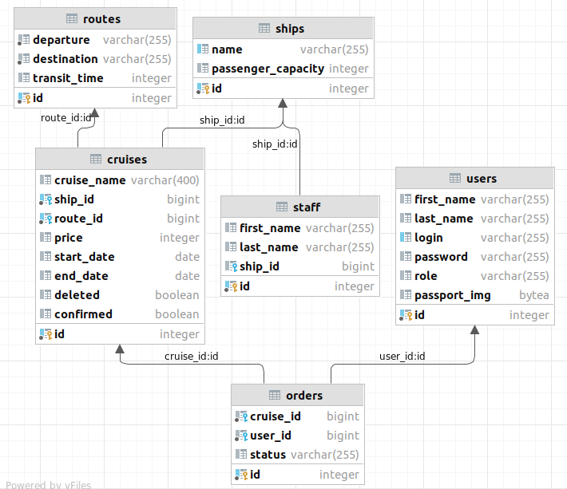

# Final Project

### The Task: Cruise company

The company has several cruise shipDTOS. 

The Ship has its own passenger capacity, route, number of ports visited, start and end of the cruise, staff.

The client selects a cruise from the catalog, places an order for it, if there are free seats, uploads a scanned copy of documents and pays the full cost of the cruise, after the cruise company administrator confirmed the possibility of the tour.
Implement the ability to choose a cruise by date and duration.

The cruise company administrator manages cruise shipDTO records and customer orders, changing their status to "paid".
The application is automatically "completed" upon the end of the cruise.

> ### Templates and patterns used in the Development
>- App is designed corresponding to MVC template
>- User class designed as Builder Pattern
>- Server actions was designed as Command Pattern
>- Used PRG(Post/Redirect/Get) Pattern
>

### Test coverage
 1.Junit5 tests 
 2.Integration Testcontainer tests 
***Total test coverage:*** 77% lines
 

### Database Visualisation 

   

## Not Authorized User Functional
- Log In/Log Out
- Sign Up
- Look through the Catalogue

## Client Functional
- Log In/Log Out
- Sign Up
- Create Order
- Pay for the Order
- Look through the Catalogue

## Administrator Functional
- Log In/Log Out
- Sign Up
- Create Cruise
- Confirm Cruise
- Edit Cruise
- Delete Cruise
- Confirm Client's Order
